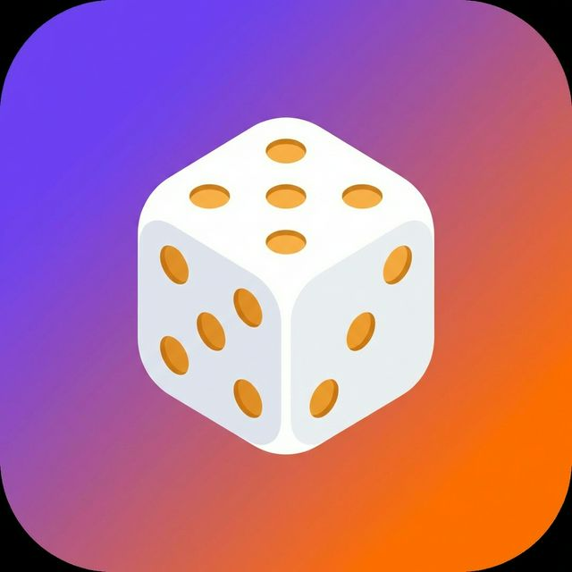

<div align="center">



# The Tie Breaker

### *Because "I don't know, where do YOU want to eat?" isn't a valid answer.*

[](https://kotlinlang.org/)
[](https://github.com)
[](https://github.com)

</div>

---

## The Problem

You're standing outside with your friend. It's 7 PM. You're both hungry. And then it happens:

> **You:** "Where do you wanna eat?"
>
> **Friend:** "I don't mind, you pick."
>
> **You:** "No, you pick."
>
> **Friend:** "Honestly, anything's fine."
>
> **You:** "Pizza?"
>
> **Friend:** "Hmm, not really feeling pizza."

**45 minutes later, you're still standing there.** Both of you are now hangry. The friendship is at risk.

## The Solution

**The Tie Breaker** — the app that makes decisions so you don't have to. Type in your options, hit DECIDE, and watch fate spin the wheel of destiny.

No more passive-aggressive "I'm fine with whatever." **The dice have spoken.**

## Features

| Feature | Description |
|---------|-------------|
| **Dynamic Options** | Add 2 to 10 choices — because sometimes life gives you more than 3 options |
| **Roulette Spin** | A dramatic, decelerating animation that builds suspense better than a Marvel movie |
| **Haptic Feedback** | Your phone literally vibrates with excitement on every tick |
| **Decision History** | Keep receipts of past decisions (for when someone says "we ALWAYS pick sushi") |
| **Dark Theme** | Because making life decisions at 11 PM shouldn't blind you |
| **No Emojis** | Pure vector graphics. We're professionals here. |

## How It Works

```
Step 1: Enter your options (Pizza, Sushi, Burgers, etc.)
Step 2: Press DECIDE
Step 3: Watch the roulette spin
Step 4: Accept your fate
Step 5: There is no Step 5. Eat.
```

## Tech Stack

- **Language:** Kotlin (because we're not savages)
- **Architecture:** Proper packages — `ui/`, `model/`, `util/` (we refactored, we grew, we learned)
- **UI:** Material 3 Dark Theme with custom vector drawables
- **Storage:** SharedPreferences for decision history (we don't need a database for this, calm down)
- **Animations:** Hand-tuned deceleration curves that feel better than a casino

## Project Structure

```
com.rizek.tiebreaker/
├── model/
│   └── DecisionResult.kt       # The verdict
├── ui/
│   ├── MainActivity.kt         # The judge
│   ├── OptionsAdapter.kt       # The contestants
│   └── HistoryAdapter.kt       # The court reporter
└── util/
    ├── RouletteEngine.kt        # The wheel of fortune
    └── HistoryManager.kt        # The historian
```

## Requirements

- Android 7.0+ (API 24)
- A minimum of 2 things you can't decide between
- At least one indecisive friend

## FAQ

**Q: Can I use this for important life decisions?**
A: We are not liable for any decisions made using this app. Including, but not limited to: career changes, relationship advice, and whether to put pineapple on pizza.

**Q: Why does it vibrate?**
A: To simulate the adrenaline rush of making a decision.

**Q: Can I add more than 10 options?**
A: No. If you can't narrow it down to 10, you have bigger problems.

**Q: Is there an iOS version?**
A: No. iOS users are used to having fewer choices anyway.

---

<div align="center">

*Made with indecision by [@rizek000](https://github.com/rizek000)*

**Stop arguing. Start deciding.**

</div>
